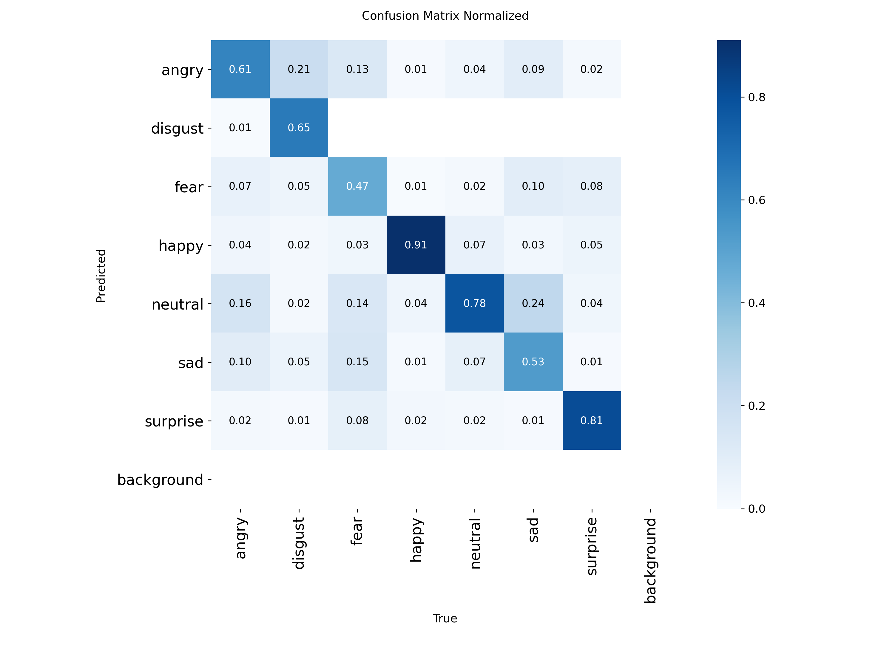
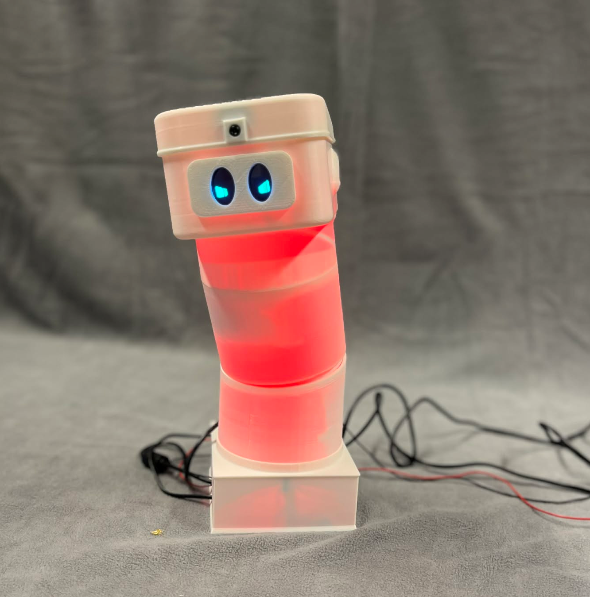
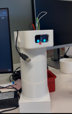

# Assignment 6 - IN5590
<!-- replace heading to name of prototype/robot -->
Siver Meek Strand & Selma Karoline Matilde Ramber Storstad


## 1) Optimization
The optimization we performed for our robot focused on improving its ability to detect a person’s emotion. To achieve this, we used two different models, one for face detection and one for emotion classification.

For face detection, we used the YuNet model [^1].
This model is responsible for detecting the face used as input to the emotion classifier, and it also allows the robot to track faces in real time.

For emotion detection, we trained a YOLO-based model using the Ultralytics Python library. We used a dataset from Kaggle [^2], which contains images labeled with seven emotions: angry, disgust, fear, happy, neutral, sad, and surprise. After training, the model reached a top-1 accuracy of 0.7, and the confusion matrix looked promising.



When using the model in a live camera feed, the quality of emotion recognition decreased, which was expected. Some emotions were very easy for the model to classify (e.g., happy and angry), while others were more difficult (e.g., sad and disgust). We also only wanted the robot to react when a person expressed the emotion clearly.

To handle these issues, we tested the model on the Raspberry Pi camera with five different people. Each person was asked to clearly display each emotion. We then recorded the confidence scores the model produced for the predicted emotion. Using these scores, we set a custom threshold for each emotion:
* Emotions like happy, angry, and surprised consistently produced high confidence values → higher thresholds.
* Emotions like sad and fear often produced lower scores → lower thresholds.

These thresholds determine whether the robot should trigger an emotional response. To avoid false positives, the robot only reacts when the same emotion is detected for at least three consecutive frames, and the confidence score is above the corresponding threshold.


## 2) Firmware/software for the robot/prototype

<!-- delete from here-->
There are 2 software parts to be delivered

All the software for the controller optimization, should be put into `./optimization/src`

All the software for getting your prototype to work, should be put into `./src`. 

If you use Python, set up a `requirement.txt` that includes all the necessary modules.
<!-- ....to here-->

Setup instructions optimization:
```
$ conda create --name <ENV_NAME> --file requirements.txt
$ conda activate <ENV_NAME>
```

Run instructions optimization: 
```
$ python 
```

Setup instructions robot:
```
$ conda create --name <ENV_NAME> --file requirements.txt
$ conda activate <ENV_NAME>
```

Run instructions robot: 
```
$ python 
```

<!-- delete from here-->
**Deliverables:** Source code in `./optimization/src` and `./src`, and setup/run instructions in this README.
<!-- ....to here-->

## 3) Images from testing the robot



[](./poster/main.pdf)


## 4) Poster

Create a poster based on the template in `./poster/`. 
There are some instructions in `./poster/README.md` in how to use the poster template.

Make a QR code that links to this github repo. See tip in `./poster/README.md`

We will hang all the posters in the common area in ROBIN after the deadline.

**Deliverables:** A nicely formatted/camera ready poster as `./poster/main.pdf`. Include all `.tex`-files and images in `./poster/` and `./poster/images/` so the PDF is reproducable. 
<!-- ....to here-->

Read more on my poster about the robot [here](./poster/main.pdf). For information on
CAD files, go to [this repo](link to assignment 5).

<!-- Replace `(link to assignment 5)` with link to *your* assignment 5.-->

## 5) Prototyping process
<!-- delete from here-->
Describe at least three iterations/milestones during the process that was crucial to reaching the goals described in assignment 4. Include images/illustrations in each of them. Example:

### Iteration 1
- **Task/milestone:** Make a compliant mechanism for animatronics robot for rotating it's head.
- **Requirements:**
    - Be able to tilt it's head $30^\circ$ in roll, yaw and pitch. Ref IMAGE.
- **Implementation:** See solidworks drawing.
- **Testing:** In simulation, the mechanism worked as intended. However, when testing in real life the mechanism broke.
- **Evaluation:** Running FEM analysis on the links that broke gave us a starting point to improve the mechanism.
- **Plan:**
    - Run topology optimization on the most fragile components.
    - Experiment with different infill.
    - Use ball bearings instead of bushings in the joints.
  
### Milestone 2
- **Task/milestone:** Make eyes for the robot.
- **Requirements:**
    - Make the robot eye animations run smoothly on two OLED screens.
- **Implementation:** Connected two OLED screens to the Raspberry Pi 3 B+. The eye animations were based on a pre-made robot-eyes simulation originally created for Arduino [^3], and later ported to MicroPython[^4].
I adapted the MicroPython version so it could run in regular Python on the Raspberry Pi. The eye images were split into two halves and displayed on each screen.

- **Testing:** We started with two small OLED screens that used the SPI protocol. After adjusting the library to work in Python, the animations looked fantastic.
However, during testing, one of the screens broke, and we had to replace both with new OLED screens. These new screens used I²C instead of SPI, which made the animation significantly slower and choppier.

- **Evaluation:** To make the I2C screens uasble we lowered the frame rate, modified the robot-eyes library to draw more pixels per update. After this the animations were able to run smoothly again.


        


### Milestone 3
- **Task/milestone:** Get face and emotion detection. 
- **Requirements:**
    - Detect faces fast.
    - Detect emotions and process them fast.
- **Implementation:** We used one model for face detection and a separate trained model for emotion recognition. The face detector finds the face, and the second model predicts the emotion shown.

- **Testing:** Our goal was to use lightweight pretrained models, since the Raspberry Pi has limited processing power and multiple tasks must run at the same time.
We initially tested a small pretrained emotion-recognition model, but when running it on the Raspberry Pi camera, the predictions were very unreliable. The model struggled to classify the correct emotion during live testing.


- **Evaluation:** To solve this, ew trained our own YOLO-based model using a Kaggle facial-expression dataset[^2]. Training the model myself allowed me to:
    - Use a smaller architecture suitable for the Raspberry Pi
    - Improve accuracy for the specific emotions we needed
    - Reduce inference time to make it viable for real-time use
After training and optimizing the model, the robot was finally able to detect emotions quickly and accurately enough for live interaction.


<!-- ....to here-->
## 6) Future work

For future work, We would like to add a microphone and a speaker so the robot can react to sound and make small expressive noises of its own. We would also investigate ways to reduce the mechanical friction noise produced by the current design. Additionally, we would work on increasing the robot’s response time to detected emotions, so that the emotional reactions feel more immediate and natural.

If we were to start the process again, we would first address the cabling issues inside the robot. The cables twist easily when the servos run in wheel mode, which is necessary because the inner tooth wheel is too small relative to the cylinder. This means the robot cannot make large movements in joint mode, so it often rotates more than intended and loses track of its position. Designing a larger gear or a more robust internal layout would avoid these problems.

Another improvement would be to redesign the head mechanism so it can move in both yaw and roll. Greater head mobility would allow the robot to express more emotions and improve its overall character animation.


## References

[^1]: (https://huggingface.co/spaces/sam749/YuNet-face-detection/blob/main/face_detection_yunet_2023mar.onnx)
[^2]: (https://www.kaggle.com/datasets/jonathanoheix/face-expression-recognition-dataset/data)
[^3]: (https://github.com/FluxGarage/RoboEyes)
[^4]: (https://github.com/mchobby/micropython-roboeyes).